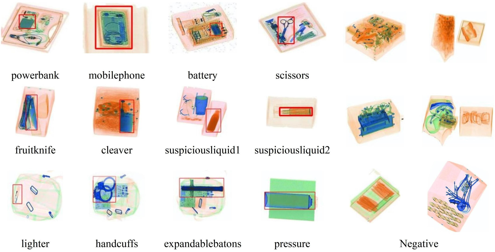
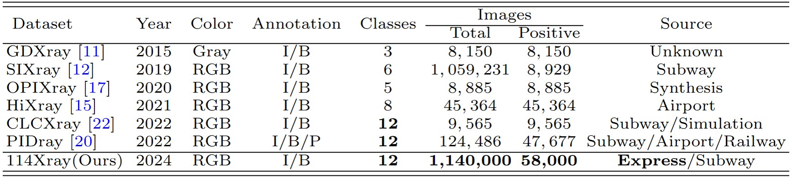
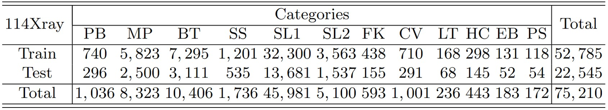

# 114Xray: A Large-scale X-ray Security Detection Benchmark and Aware Enhance Network for Real-World Prohibited Item Inspection in Baggage (PRCV2024)
This repository is the official implementation of AENet and 114Xray dataset. Paper link: [Comming soon].

## Motivation
1. Existing datasets have a limited number and variety of prohibited items, focusing on rare items, while excluding common prohibited items in real scenarios.
2. In real-world scenarios, prohibited items of the same category exhibit diverse morphology and placement angles. However, existing datasets provide limited variations in morphology and placement position.
3. Most existing datasets are derived from only one source, such as subway, airport, or artificially synthesized data.

## Contributions
1. We propose a large-scale, high-quality dataset, named 114Xray, for real-world prohibited item inspection. It consists of 1, 140, 000 X-ray images across 12 categories of prohibited items. Among them, 58, 000 images contain 75, 210 common prohibited items. What is worth noting is that each category exhibits rich morphology and imaging angles, while the distribution of categories and samples aligns well with real-world security scenarios. 
2. Inspired by the steps taken by security experts in identifying prohibited items, we propose AENet, which consists of the MASI and EA modules. MASI enhances the network's perception of materials by leveraging information interaction across channel and spatial dimensions. EA utilizes a multi-branch structure to improve the network's foreground perception capability.

## The 114Xray Dataset

Fig. 1. Example images of the 114Xray dataset, containing 12 classes of prohibited and non-prohibited items

Table 1. Statistics and Comparison of X-ray benchmarks

Table 2. Distribution of Categories in the 114Xray dataset

1. Data Colletction: Real X-ray scenarios in express delivery and subway security. Focus on common prohibited items to enhance security inspection research.
2. Data Annotation: 3 years collecting and annotating data from express delivery and subway stations. 3 months reviewing and optimizing annotations. Multi-step process and human-in-the-loop design ensure high-quality annotations and an efficient workflow.

## Citation
If you find this dataset useful for your research, please cite

    @inproceedings{ming076_2024_114Xray,
       title={114Xray: A Large-scale X-ray Security Detection Benchmark and Aware Enhance Network for Real-World Prohibited Item Inspection in Baggage},
       author={Hongxia Gao1, Zhenming Guan, Yaobin Huang, Xiaomeng Li, Hongyu Liao, Bin Huang, Hongzhen Zheng, Runze Lin, Litao Li, Haolin Tang, Guoyuan Lin, and Zhanhong Chen},
       booktitle={The 7th Chinese Conference on Pattern Recognition and Computer Vision PRCV 2024},
       pages={},
       year={2024}
    }
## License

The images and the corresponding annotations in 114Xray Dataset can be used ONLY for academic purposes, NOT for commercial purposes.

Copyright © 2024 South China University of Technology, Pazhou Laboratory, Guangzhou InsightinFuture AI Technology Co., Ltd.

All rights reserved.
